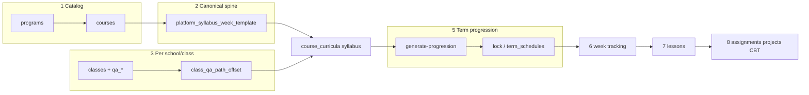

# Learning, QA spine, and curriculum architecture

This document is the **single narrative** for how a **shared standard** (many schools, one spine) maps into **per-school syllabi** and **lesson delivery**. The live checklist in the app: **Curriculum → System map** (`/dashboard/curriculum/learning-system`). The machine-readable order lives in `src/lib/learning/qaSystemOrder.ts` — **update that file first**, then this doc, so nothing drifts.

## Design goals

1. **Inject once, reuse everywhere** — `platform_syllabus_week_template` holds versioned week topics (`catalog_version`, e.g. `qa_spine_v1`).
2. **Per-class progression without forking the spine** — `class_qa_path_offset(school, class)` rotates which spine week maps to the calendar; optional `classes.qa_*` columns pin lane/grade.
3. **Syllabus is the contract** — `course_curricula.content` is what teachers, learners, and automation agree on. Lesson plans and generated lessons should reference `curriculum_version_id` when available.
4. **Transparency** — any new API or table must be added to `qaSystemOrder.ts` and linked from the System map page.
5. **Versions are not the same thing** — `course_curricula.version` moves whenever that syllabus copy changes. `catalog_version` on the platform spine (e.g. `qa_spine_v1`) can change in a *future* migration; “recent QA” is whatever migrations last defined.
6. **Flexibility in one place** — optional spine apply, org-wide “compulsory” as *policy* (class fields + process), or traditional week-by-week without spine; all three are described on the System map and in `DELIVERY_MODE_CHOICES` in `qaSystemOrder.ts`.

## Linear flow (high level)

**Term progression (step 5)** sits **immediately after the syllabus (step 4)** and **before** operational teaching: it turns the QA/regular `course_curricula` contract into per-year/term grids on the linked lesson plan, then you track weeks, run live lessons, and assign work. It is **not** “last” after homework and projects.

## Versioning (what to show in UI)

| Label | Where | Note |
|-------|--------|------|
| Syllabus copy | `course_curricula.version` | Bumps on regen, edit, or apply-qa-spine. |
| QA spine catalog | `…catalog_version` on template rows | Can change in a new migration; not a promise never to change. |
| Last spine apply | `content.metadata.qa_spine` | Audit snapshot: lane, offset, `catalog_version` at apply time. |
| Class | `classes.qa_grade_mode` etc. | `optional` vs `compulsory` for grade; operational lever for your org. |

`LEARNING_VERSIONING` in `qaSystemOrder.ts` mirrors this for the app and the API.

## Delivery choices (policy, not a fork of the app)

`DELIVERY_MODE_CHOICES` in `qaSystemOrder.ts` documents three **mindsets**: spine optional, adopt spine as your compulsory standard, or traditional week-by-week with no injection.

## Recommended low-risk flow (not imposed)

1. Keep `qa_grade_mode = optional`.
   - You can now switch per class in the Curriculum QA panel (`optional` / `compulsory`) without forcing all classes.
2. In Curriculum, inspect template rows/lanes and run class preview first.
3. If preview does **not** fit, skip apply and keep traditional week-by-week.
4. If preview fits, apply spine to the current syllabus copy (`overwrite` off by default).
5. Generate term progression (step 5 in the linear flow), then do tracking, lessons, and assignments.

## Key migrations (chronology)

| Migration | What it does |
|-----------|----------------|
| `20260422120000_platform_syllabus_week_template.sql` | Table + seed + RLS (staff read) |
| `20260422140000_class_qa_explicit_topics_and_path.sql` | `class_qa_path_offset`, `qa_build_explicit_topic`, `classes` QA columns, topic refresh |
| `20260501000012_course_curricula.sql` | `course_curricula` + FK from `lesson_plans` |
| `20260501000050_curriculum_tracking.sql` | Week tracking linked to curriculum |

## API surface (QA alignment)

- `GET /api/learning-system-map` — **Full ordered map** (DB tables, migrations, routes, app paths) as JSON; same content as the System map UI. **Staff only** (admin/teacher). Response: `{ data: { version, generatedAt, catalogVersion, summary, source, layers, versioning, deliveryModeChoices } }`.
- `GET /api/platform-syllabus-template` — read spine rows (filters: `program_id`, `lane_index`, `catalog_version`).
- `GET /api/classes/[id]/qa-spine-preview` — preview rotated weeks for a class and programme year.
- `POST /api/curricula/apply-qa-spine` — merge spine into a **specific** `course_curricula` row (optional `class_id` for path offset, `year_number` 1–3, optional `lane_index`).

`GET /api/learning-system-map` is generated from `buildLearningSystemMapResponse()` in `src/lib/learning/qaSystemOrder.ts` — that file is the **only** source of truth for the list of layers; the dashboard page and this doc should follow it.

## Recommendations (operations)

1. **After any migration** run `npm run db:types:linked` (or `db:types:local`) and commit `src/types/supabase.ts` so the app stays type-safe.
2. **New programmes** need spine rows for their `program_id` (see seed in `20260422120000_*` / admin tooling) before `apply-qa-spine` can be deterministic.
3. **Fifty schools** do **not** need fifty spines: they share `qa_spine_v1`; diversity is in **class offset** and optional **lane** overrides.
4. When adding a feature, append **one** step to `LEARNING_QA_SYSTEM_ORDER` or extend an existing step — avoid orphan routes with no table and no doc line.

## Related code

- `src/lib/qa/resolveQaSpineLane.ts` — lane from class metadata.
- `src/lib/qa/rotatedSpineIndex.ts` — calendar index ↔ spine index.
- `src/app/api/curricula/apply-qa-spine/route.ts` — apply merge + metadata.
- `src/app/dashboard/curriculum/page.tsx` — optional QA panel on the Course Syllabus tab.
