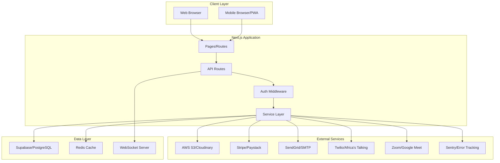

# LMS System Completion - Technical Design Document

## Overview

This design document specifies the technical approach for completing the multi-school Learning Management System (LMS). The system is built on Next.js 15, React 18, TypeScript, and Supabase (PostgreSQL), with an existing foundation of 20+ database tables, authentication, and basic LMS features.

### Design Goals

1. **Extend, Don't Replace**: Build upon the existing architecture rather than redesigning from scratch
2. **Production-Ready**: Implement comprehensive error handling, logging, monitoring, and security
3. **Multi-Tenancy**: Ensure complete data isolation between schools using RLS policies
4. **Scalability**: Design for growth with proper caching, connection pooling, and performance optimization
5. **Integration-First**: Seamlessly integrate external services (S3, Stripe, SendGrid, Twilio, Zoom)
6. **Real-Time Capable**: Add WebSocket support for live notifications and messaging
7. **Mobile-Responsive**: Ensure excellent experience across all device sizes

### Scope

This design covers 15 major feature areas:
- Complete API layer with validation and rate limiting
- File upload and management with cloud storage
- Enhanced multi-tenancy with RLS enforcement
- Payment integration (Stripe/Paystack)
- Notification system (email/SMS)
- Computer-Based Testing (CBT) engine
- Real-time features via WebSocket
- Discussion forums
- Certificates and badges
- Enhanced analytics
- Video conferencing integration
- Content library management
- Gamification features
- Mobile responsiveness
- Production readiness (logging, monitoring, error handling)

## Architecture

### High-Level Architecture



### Technology Stack

**Frontend:**
- Next.js 15 (App Router)
- React 18
- TypeScript
- Tailwind CSS
- Radix UI components
- React Hook Form (form validation)
- Zod (schema validation)

**Backend:**
- Next.js API Routes
- Supabase (PostgreSQL with RLS)
- Redis (caching and session management)
- WebSocket (Socket.io or native WebSocket)

**External Integrations:**
- AWS S3 or Cloudinary (file storage)
- Stripe or Paystack (payments)
- SendGrid or SMTP (email)
- Twilio or Africa's Talking (SMS)
- Zoom or Google Meet (video conferencing)
- Sentry or Rollbar (error tracking)
- Datadog or New Relic (monitoring)

### Architectural Patterns

1. **Service Layer Pattern**: Continue using the existing service layer pattern for business logic
2. **Repository Pattern**: Add repository layer for complex data access patterns
3. **Middleware Chain**: Extend middleware for authentication, tenant context, rate limiting
4. **Event-Driven**: Use event emitters for notifications and real-time updates
5. **Circuit Breaker**: Implement circuit breakers for external service calls
6. **Caching Strategy**: Multi-level caching (Redis, in-memory, CDN)

## Components and Interfaces

### API Layer Structure

All API routes follow RESTful conventions and are organized under `/app/api/`:

```
/app/api/
├── programs/
│   ├── route.ts              # GET (list), POST (create)
│   └── [id]/
│       └── route.ts          # GET, PUT, DELETE
├── courses/
│   ├── route.ts
│   ├── [id]/
│   │   ├── route.ts
│   │   ├── enroll/route.ts
│   │   └── unenroll/route.ts
├── lessons/
│   ├── route.ts
│   └── [id]/
│       ├── route.ts
│       └── complete/route.ts
├── assignments/
│   ├── route.ts
│   └── [id]/
│       ├── route.ts
│       ├── submit/route.ts
│       └── grade/route.ts
├── exams/
│   ├── route.ts
│   └── [id]/
│       ├── route.ts
│       ├── start/route.ts
│       ├── submit/route.ts
│       └── grade/route.ts
├── attendance/
│   ├── route.ts
│   └── [id]/
│       ├── route.ts
│       ├── mark-present/route.ts
│       └── mark-absent/route.ts
├── grades/
│   ├── route.ts
│   └── calculate-gpa/route.ts
├── announcements/
│   ├── route.ts
│   └── [id]/route.ts
├── discussions/
│   ├── route.ts
│   └── [id]/
│       ├── route.ts
│       └── reply/route.ts
├── certificates/
│   ├── route.ts
│   ├── [id]/route.ts
│   └── generate/route.ts
├── files/
│   ├── upload/route.ts
│   ├── [id]/route.ts
│   └── signed-url/route.ts
├── payments/
│   ├── checkout/route.ts
│   ├── webhook/route.ts
│   └── [id]/route.ts
├── notifications/
│   ├── route.ts
│   └── [id]/
│       ├── route.ts
│       └── mark-read/route.ts
└── analytics/
    ├── overview/route.ts
    ├── student/[id]/route.ts
    └── course/[id]/route.ts
```

### Service Layer Extensions

Extend existing service pattern with new services:

```typescript
// src/services/
├── auth.service.ts           # Existing
├── dashboard.service.ts      # Existing
├── schools.service.ts        # Existing
├── students.service.ts       # Existing
├── teachers.service.ts       # Existing
├── programs.service.ts       # New
├── courses.service.ts        # New
├── lessons.service.ts        # New
├── assignments.service.ts    # New
├── exams.service.ts          # New - CBT engine
├── files.service.ts          # New - file management
├── payments.service.ts       # New - payment processing
├── notifications.service.ts  # New - email/SMS
├── realtime.service.ts       # New - WebSocket
├── discussions.service.ts    # New - forums
├── certificates.service.ts   # New - certificate generation
├── analytics.service.ts      # New - analytics engine
├── video.service.ts          # New - video conferencing
├── content.service.ts        # New - content library
└── gamification.service.ts   # New - points/badges
```

### Middleware Extensions

Enhance existing middleware with additional layers:

```typescript
// src/middleware/
├── auth.middleware.ts        # Authentication check
├── tenant.middleware.ts      # Tenant context setting
├── rateLimit.middleware.ts   # Rate limiting
├── validation.middleware.ts  # Request validation
├── logging.middleware.ts     # Request logging
└── error.middleware.ts       # Error handling
```

### Database Schema Extensions

Add new tables to support additional features:

```sql
-- Exams and CBT
CREATE TABLE exams (
  id UUID PRIMARY KEY DEFAULT gen_random_uuid(),
  course_id UUID REFERENCES courses(id),
  title TEXT NOT NULL,
  description TEXT,
  duration_minutes INTEGER,
  total_points INTEGER DEFAULT 100,
  passing_score INTEGER DEFAULT 70,
  randomize_questions BOOLEAN DEFAULT true,
  randomize_options BOOLEAN DEFAULT true,
  max_attempts INTEGER DEFAULT 1,
  is_active BOOLEAN DEFAULT true,
  created_by UUID REFERENCES portal_users(id),
  created_at TIMESTAMPTZ DEFAULT NOW(),
  updated_at TIMESTAMPTZ DEFAULT NOW()
);

CREATE TABLE exam_questions (
  id UUID PRIMARY KEY DEFAULT gen_random_uuid(),
  exam_id UUID REFERENCES exams(id) ON DELETE CASCADE,
  question_text TEXT NOT NULL,
  question_type TEXT CHECK (question_type IN ('multiple_choice', 'true_false', 'short_answer', 'essay', 'matching', 'fill_in_blank')),
  points INTEGER DEFAULT 1,
  order_index INTEGER,
  options JSONB, -- For multiple choice, matching, etc.
  correct_answer JSONB, -- Stores correct answer(s)
  explanation TEXT,
  created_at TIMESTAMPTZ DEFAULT NOW()
);

CREATE TABLE exam_attempts (
  id UUID PRIMARY KEY DEFAULT gen_random_uuid(),
  exam_id UUID REFERENCES exams(id),
  portal_user_id UUID REFERENCES portal_users(id),
  attempt_number INTEGER DEFAULT 1,
  started_at TIMESTAMPTZ DEFAULT NOW(),
  submitted_at TIMESTAMPTZ,
  score INTEGER,
  total_points INTEGER,
  percentage DECIMAL(5,2),
  status TEXT CHECK (status IN ('in_progress', 'submitted', 'graded', 'abandoned')),
  answers JSONB, -- Stores all answers
  tab_switches INTEGER DEFAULT 0, -- Cheating detection
  created_at TIMESTAMPTZ DEFAULT NOW()
);

-- Files and Media
CREATE TABLE files (
  id UUID PRIMARY KEY DEFAULT gen_random_uuid(),
  school_id UUID REFERENCES schools(id),
  uploaded_by UUID REFERENCES portal_users(id),
  filename TEXT NOT NULL,
  original_filename TEXT NOT NULL,
  file_type TEXT NOT NULL,
  file_size BIGINT NOT NULL,
  mime_type TEXT,
  storage_path TEXT NOT NULL,
  storage_provider TEXT CHECK (storage_provider IN ('s3', 'cloudinary')),
  public_url TEXT,
  thumbnail_url TEXT,
  is_virus_scanned BOOLEAN DEFAULT false,
  virus_scan_result TEXT,
  download_count INTEGER DEFAULT 0,
  metadata JSONB,
  created_at TIMESTAMPTZ DEFAULT NOW(),
  updated_at TIMESTAMPTZ DEFAULT NOW()
);

-- Payments
CREATE TABLE payment_transactions (
  id UUID PRIMARY KEY DEFAULT gen_random_uuid(),
  school_id UUID REFERENCES schools(id),
  portal_user_id UUID REFERENCES portal_users(id),
  course_id UUID REFERENCES courses(id),
  amount DECIMAL(10,2) NOT NULL,
  currency TEXT DEFAULT 'NGN',
  payment_method TEXT CHECK (payment_method IN ('stripe', 'paystack', 'bank_transfer')),
  payment_status TEXT CHECK (payment_status IN ('pending', 'processing', 'completed', 'failed', 'refunded')) DEFAULT 'pending',
  transaction_reference TEXT UNIQUE,
  external_transaction_id TEXT,
  payment_gateway_response JSONB,
  paid_at TIMESTAMPTZ,
  refunded_at TIMESTAMPTZ,
  refund_reason TEXT,
  created_at TIMESTAMPTZ DEFAULT NOW(),
  updated_at TIMESTAMPTZ DEFAULT NOW()
);

CREATE TABLE subscriptions (
  id UUID PRIMARY KEY DEFAULT gen_random_uuid(),
  portal_user_id UUID REFERENCES portal_users(id),
  course_id UUID REFERENCES courses(id),
  subscription_plan TEXT,
  amount DECIMAL(10,2) NOT NULL,
  currency TEXT DEFAULT 'NGN',
  billing_cycle TEXT CHECK (billing_cycle IN ('monthly', 'quarterly', 'yearly')),
  status TEXT CHECK (status IN ('active', 'cancelled', 'expired', 'suspended')) DEFAULT 'active',
  current_period_start TIMESTAMPTZ,
  current_period_end TIMESTAMPTZ,
  external_subscription_id TEXT,
  created_at TIMESTAMPTZ DEFAULT NOW(),
  updated_at TIMESTAMPTZ DEFAULT NOW()
);

-- Notifications (extend existing)
ALTER TABLE notifications ADD COLUMN IF NOT EXISTS notification_channel TEXT CHECK (notification_channel IN ('email', 'sms', 'in_app', 'push'));
ALTER TABLE notifications ADD COLUMN IF NOT EXISTS sent_at TIMESTAMPTZ;
ALTER TABLE notifications ADD COLUMN IF NOT EXISTS delivery_status TEXT CHECK (delivery_status IN ('pending', 'sent', 'failed', 'bounced'));
ALTER TABLE notifications ADD COLUMN IF NOT EXISTS retry_count INTEGER DEFAULT 0;
ALTER TABLE notifications ADD COLUMN IF NOT EXISTS external_id TEXT;

CREATE TABLE notification_preferences (
  id UUID PRIMARY KEY DEFAULT gen_random_uuid(),
  portal_user_id UUID REFERENCES portal_users(id) UNIQUE,
  email_enabled BOOLEAN DEFAULT true,
  sms_enabled BOOLEAN DEFAULT false,
  push_enabled BOOLEAN DEFAULT true,
  assignment_reminders BOOLEAN DEFAULT true,
  grade_notifications BOOLEAN DEFAULT true,
  announcement_notifications BOOLEAN DEFAULT true,
  discussion_replies BOOLEAN DEFAULT true,
  marketing_emails BOOLEAN DEFAULT false,
  created_at TIMESTAMPTZ DEFAULT NOW(),
  updated_at TIMESTAMPTZ DEFAULT NOW()
);

-- Discussions/Forums
CREATE TABLE discussion_topics (
  id UUID PRIMARY KEY DEFAULT gen_random_uuid(),
  course_id UUID REFERENCES courses(id),
  created_by UUID REFERENCES portal_users(id),
  title TEXT NOT NULL,
  content TEXT NOT NULL,
  is_pinned BOOLEAN DEFAULT false,
  is_locked BOOLEAN DEFAULT false,
  is_resolved BOOLEAN DEFAULT false,
  upvotes INTEGER DEFAULT 0,
  view_count INTEGER DEFAULT 0,
  created_at TIMESTAMPTZ DEFAULT NOW(),
  updated_at TIMESTAMPTZ DEFAULT NOW()
);

CREATE TABLE discussion_replies (
  id UUID PRIMARY KEY DEFAULT gen_random_uuid(),
  topic_id UUID REFERENCES discussion_topics(id) ON DELETE CASCADE,
  parent_reply_id UUID REFERENCES discussion_replies(id),
  created_by UUID REFERENCES portal_users(id),
  content TEXT NOT NULL,
  upvotes INTEGER DEFAULT 0,
  is_accepted_answer BOOLEAN DEFAULT false,
  created_at TIMESTAMPTZ DEFAULT NOW(),
  updated_at TIMESTAMPTZ DEFAULT NOW()
);

CREATE TABLE discussion_attachments (
  id UUID PRIMARY KEY DEFAULT gen_random_uuid(),
  topic_id UUID REFERENCES discussion_topics(id),
  reply_id UUID REFERENCES discussion_replies(id),
  file_id UUID REFERENCES files(id),
  created_at TIMESTAMPTZ DEFAULT NOW()
);

-- Certificates and Badges
CREATE TABLE certificates (
  id UUID PRIMARY KEY DEFAULT gen_random_uuid(),
  portal_user_id UUID REFERENCES portal_users(id),
  course_id UUID REFERENCES courses(id),
  certificate_number TEXT UNIQUE NOT NULL,
  verification_code TEXT UNIQUE NOT NULL,
  issued_date DATE NOT NULL,
  pdf_url TEXT,
  template_id UUID,
  metadata JSONB,
  created_at TIMESTAMPTZ DEFAULT NOW()
);

CREATE TABLE badges (
  id UUID PRIMARY KEY DEFAULT gen_random_uuid(),
  school_id UUID REFERENCES schools(id),
  name TEXT NOT NULL,
  description TEXT,
  icon_url TEXT,
  criteria JSONB, -- Defines how to earn the badge
  points_value INTEGER DEFAULT 0,
  is_active BOOLEAN DEFAULT true,
  created_at TIMESTAMPTZ DEFAULT NOW()
);

CREATE TABLE user_badges (
  id UUID PRIMARY KEY DEFAULT gen_random_uuid(),
  portal_user_id UUID REFERENCES portal_users(id),
  badge_id UUID REFERENCES badges(id),
  earned_at TIMESTAMPTZ DEFAULT NOW(),
  metadata JSONB,
  UNIQUE(portal_user_id, badge_id)
);

-- Gamification
CREATE TABLE user_points (
  id UUID PRIMARY KEY DEFAULT gen_random_uuid(),
  portal_user_id UUID REFERENCES portal_users(id) UNIQUE,
  total_points INTEGER DEFAULT 0,
  current_streak INTEGER DEFAULT 0,
  longest_streak INTEGER DEFAULT 0,
  last_activity_date DATE,
  achievement_level TEXT CHECK (achievement_level IN ('Bronze', 'Silver', 'Gold', 'Platinum')) DEFAULT 'Bronze',
  created_at TIMESTAMPTZ DEFAULT NOW(),
  updated_at TIMESTAMPTZ DEFAULT NOW()
);

CREATE TABLE point_transactions (
  id UUID PRIMARY KEY DEFAULT gen_random_uuid(),
  portal_user_id UUID REFERENCES portal_users(id),
  points INTEGER NOT NULL,
  activity_type TEXT NOT NULL, -- 'lesson_complete', 'assignment_submit', 'discussion_post', etc.
  reference_id UUID, -- ID of the related entity
  description TEXT,
  created_at TIMESTAMPTZ DEFAULT NOW()
);

CREATE TABLE leaderboards (
  id UUID PRIMARY KEY DEFAULT gen_random_uuid(),
  course_id UUID REFERENCES courses(id),
  portal_user_id UUID REFERENCES portal_users(id),
  points INTEGER DEFAULT 0,
  rank INTEGER,
  period_start DATE,
  period_end DATE,
  created_at TIMESTAMPTZ DEFAULT NOW(),
  updated_at TIMESTAMPTZ DEFAULT NOW()
);

-- Content Library
CREATE TABLE content_library (
  id UUID PRIMARY KEY DEFAULT gen_random_uuid(),
  school_id UUID REFERENCES schools(id),
  created_by UUID REFERENCES portal_users(id),
  title TEXT NOT NULL,
  description TEXT,
  content_type TEXT CHECK (content_type IN ('video', 'document', 'quiz', 'presentation', 'interactive')),
  file_id UUID REFERENCES files(id),
  category TEXT,
  tags TEXT[],
  subject TEXT,
  grade_level TEXT,
  license_type TEXT,
  attribution TEXT,
  version INTEGER DEFAULT 1,
  usage_count INTEGER DEFAULT 0,
  rating_average DECIMAL(3,2),
  rating_count INTEGER DEFAULT 0,
  is_approved BOOLEAN DEFAULT false,
  approved_by UUID REFERENCES portal_users(id),
  approved_at TIMESTAMPTZ,
  is_active BOOLEAN DEFAULT true,
  created_at TIMESTAMPTZ DEFAULT NOW(),
  updated_at TIMESTAMPTZ DEFAULT NOW()
);

CREATE TABLE content_ratings (
  id UUID PRIMARY KEY DEFAULT gen_random_uuid(),
  content_id UUID REFERENCES content_library(id),
  portal_user_id UUID REFERENCES portal_users(id),
  rating INTEGER CHECK (rating >= 1 AND rating <= 5),
  review TEXT,
  created_at TIMESTAMPTZ DEFAULT NOW(),
  UNIQUE(content_id, portal_user_id)
);

-- Video Conferencing
CREATE TABLE live_sessions (
  id UUID PRIMARY KEY DEFAULT gen_random_uuid(),
  course_id UUID REFERENCES courses(id),
  instructor_id UUID REFERENCES portal_users(id),
  title TEXT NOT NULL,
  description TEXT,
  scheduled_start TIMESTAMPTZ NOT NULL,
  scheduled_end TIMESTAMPTZ NOT NULL,
  actual_start TIMESTAMPTZ,
  actual_end TIMESTAMPTZ,
  meeting_url TEXT,
  meeting_id TEXT,
  meeting_password TEXT,
  provider TEXT CHECK (provider IN ('zoom', 'google_meet', 'microsoft_teams')),
  recording_url TEXT,
  status TEXT CHECK (status IN ('scheduled', 'live', 'completed', 'cancelled')) DEFAULT 'scheduled',
  created_at TIMESTAMPTZ DEFAULT NOW(),
  updated_at TIMESTAMPTZ DEFAULT NOW()
);

CREATE TABLE live_session_attendance (
  id UUID PRIMARY KEY DEFAULT gen_random_uuid(),
  session_id UUID REFERENCES live_sessions(id),
  portal_user_id UUID REFERENCES portal_users(id),
  joined_at TIMESTAMPTZ,
  left_at TIMESTAMPTZ,
  duration_minutes INTEGER,
  created_at TIMESTAMPTZ DEFAULT NOW(),
  UNIQUE(session_id, portal_user_id)
);

-- Lessons (extend existing or create if not exists)
CREATE TABLE IF NOT EXISTS lessons (
  id UUID PRIMARY KEY DEFAULT gen_random_uuid(),
  course_id UUID REFERENCES courses(id),
  title TEXT NOT NULL,
  description TEXT,
  content TEXT,
  lesson_type TEXT CHECK (lesson_type IN ('video', 'reading', 'quiz', 'assignment', 'live_session')),
  duration_minutes INTEGER,
  order_index INTEGER,
  video_url TEXT,
  is_active BOOLEAN DEFAULT true,
  created_by UUID REFERENCES portal_users(id),
  created_at TIMESTAMPTZ DEFAULT NOW(),
  updated_at TIMESTAMPTZ DEFAULT NOW()
);

CREATE TABLE lesson_progress (
  id UUID PRIMARY KEY DEFAULT gen_random_uuid(),
  lesson_id UUID REFERENCES lessons(id),
  portal_user_id UUID REFERENCES portal_users(id),
  status TEXT CHECK (status IN ('not_started', 'in_progress', 'completed')) DEFAULT 'not_started',
  progress_percentage INTEGER DEFAULT 0,
  time_spent_minutes INTEGER DEFAULT 0,
  completed_at TIMESTAMPTZ,
  created_at TIMESTAMPTZ DEFAULT NOW(),
  updated_at TIMESTAMPTZ DEFAULT NOW(),
  UNIQUE(lesson_id, portal_user_id)
);

-- Announcements (extend or create)
CREATE TABLE IF NOT EXISTS announcements (
  id UUID PRIMARY KEY DEFAULT gen_random_uuid(),
  school_id UUID REFERENCES schools(id),
  course_id UUID REFERENCES courses(id),
  created_by UUID REFERENCES portal_users(id),
  title TEXT NOT NULL,
  content TEXT NOT NULL,
  priority TEXT CHECK (priority IN ('low', 'normal', 'high', 'urgent')) DEFAULT 'normal',
  target_audience TEXT CHECK (target_audience IN ('all', 'students', 'teachers', 'course_specific')),
  is_published BOOLEAN DEFAULT false,
  published_at TIMESTAMPTZ,
  expires_at TIMESTAMPTZ,
  created_at TIMESTAMPTZ DEFAULT NOW(),
  updated_at TIMESTAMPTZ DEFAULT NOW()
);

-- Add school_id to existing tables for multi-tenancy
ALTER TABLE portal_users ADD COLUMN IF NOT EXISTS school_id UUID REFERENCES schools(id);
ALTER TABLE programs ADD COLUMN IF NOT EXISTS school_id UUID REFERENCES schools(id);
ALTER TABLE courses ADD COLUMN IF NOT EXISTS school_id UUID REFERENCES schools(id);
ALTER TABLE classes ADD COLUMN IF NOT EXISTS school_id UUID REFERENCES schools(id);
```

### API Request/Response Schemas

All API endpoints use Zod schemas for validation:

```typescript
// src/schemas/api.schemas.ts

import { z } from 'zod';

// Program schemas
export const createProgramSchema = z.object({
  name: z.string().min(3).max(100),
  description: z.string().optional(),
  duration_weeks: z.number().int().positive(),
  difficulty_level: z.enum(['beginner', 'intermediate', 'advanced']),
  price: z.number().positive(),
  max_students: z.number().int().positive(),
});

export const updateProgramSchema = createProgramSchema.partial();

// Course schemas
export const createCourseSchema = z.object({
  program_id: z.string().uuid(),
  title: z.string().min(3).max(200),
  description: z.string().optional(),
  duration_hours: z.number().int().positive(),
  teacher_id: z.string().uuid().optional(),
});

// Assignment schemas
export const createAssignmentSchema = z.object({
  course_id: z.string().uuid(),
  title: z.string().min(3).max(200),
  description: z.string().optional(),
  instructions: z.string(),
  due_date: z.string().datetime(),
  max_points: z.number().int().positive().default(100),
  assignment_type: z.enum(['homework', 'project', 'quiz', 'exam', 'presentation']),
});

export const submitAssignmentSchema = z.object({
  assignment_id: z.string().uuid(),
  submission_text: z.string().optional(),
  file_url: z.string().url().optional(),
}).refine(data => data.submission_text || data.file_url, {
  message: "Either submission_text or file_url must be provided"
});

export const gradeAssignmentSchema = z.object({
  grade: z.number().int().min(0).max(100),
  feedback: z.string().optional(),
});

// Exam schemas
export const createExamSchema = z.object({
  course_id: z.string().uuid(),
  title: z.string().min(3).max(200),
  description: z.string().optional(),
  duration_minutes: z.number().int().positive(),
  total_points: z.number().int().positive().default(100),
  passing_score: z.number().int().min(0).max(100).default(70),
  randomize_questions: z.boolean().default(true),
  randomize_options: z.boolean().default(true),
  max_attempts: z.number().int().positive().default(1),
});

export const createExamQuestionSchema = z.object({
  exam_id: z.string().uuid(),
  question_text: z.string().min(10),
  question_type: z.enum(['multiple_choice', 'true_false', 'short_answer', 'essay', 'matching', 'fill_in_blank']),
  points: z.number().int().positive().default(1),
  options: z.any().optional(), // JSONB
  correct_answer: z.any(), // JSONB
  explanation: z.string().optional(),
});

// File upload schema
export const fileUploadSchema = z.object({
  file: z.instanceof(File),
  folder: z.string().optional(),
  is_public: z.boolean().default(false),
});

// Payment schemas
export const createCheckoutSchema = z.object({
  course_id: z.string().uuid(),
  amount: z.number().positive(),
  currency: z.string().default('NGN'),
  payment_method: z.enum(['stripe', 'paystack']),
});

// Discussion schemas
export const createDiscussionSchema = z.object({
  course_id: z.string().uuid(),
  title: z.string().min(5).max(200),
  content: z.string().min(10),
});

export const createReplySchema = z.object({
  topic_id: z.string().uuid(),
  parent_reply_id: z.string().uuid().optional(),
  content: z.string().min(1),
});

// Pagination schema
export const paginationSchema = z.object({
  page: z.number().int().positive().default(1),
  limit: z.number().int().positive().max(100).default(20),
  sort_by: z.string().optional(),
  sort_order: z.enum(['asc', 'desc']).default('desc'),
});
```


## Data Models

### Core Entity Models

```typescript
// src/types/entities.ts

export interface Program {
  id: string;
  school_id: string;
  name: string;
  description?: string;
  duration_weeks: number;
  difficulty_level: 'beginner' | 'intermediate' | 'advanced';
  price: number;
  max_students: number;
  is_active: boolean;
  created_at: string;
  updated_at: string;
}

export interface Course {
  id: string;
  school_id: string;
  program_id: string;
  title: string;
  description?: string;
  duration_hours: number;
  teacher_id?: string;
  is_active: boolean;
  created_at: string;
  updated_at: string;
}

export interface Lesson {
  id: string;
  course_id: string;
  title: string;
  description?: string;
  content?: string;
  lesson_type: 'video' | 'reading' | 'quiz' | 'assignment' | 'live_session';
  duration_minutes?: number;
  order_index: number;
  video_url?: string;
  is_active: boolean;
  created_by: string;
  created_at: string;
  updated_at: string;
}

export interface Assignment {
  id: string;
  course_id: string;
  title: string;
  description?: string;
  instructions: string;
  due_date: string;
  max_points: number;
  assignment_type: 'homework' | 'project' | 'quiz' | 'exam' | 'presentation';
  is_active: boolean;
  created_by: string;
  created_at: string;
  updated_at: string;
}

export interface Exam {
  id: string;
  course_id: string;
  title: string;
  description?: string;
  duration_minutes: number;
  total_points: number;
  passing_score: number;
  randomize_questions: boolean;
  randomize_options: boolean;
  max_attempts: number;
  is_active: boolean;
  created_by: string;
  created_at: string;
  updated_at: string;
}

export interface ExamQuestion {
  id: string;
  exam_id: string;
  question_text: string;
  question_type: 'multiple_choice' | 'true_false' | 'short_answer' | 'essay' | 'matching' | 'fill_in_blank';
  points: number;
  order_index: number;
  options?: any; // JSONB
  correct_answer: any; // JSONB
  explanation?: string;
  created_at: string;
}

export interface ExamAttempt {
  id: string;
  exam_id: string;
  portal_user_id: string;
  attempt_number: number;
  started_at: string;
  submitted_at?: string;
  score?: number;
  total_points: number;
  percentage?: number;
  status: 'in_progress' | 'submitted' | 'graded' | 'abandoned';
  answers: any; // JSONB
  tab_switches: number;
  created_at: string;
}

export interface File {
  id: string;
  school_id: string;
  uploaded_by: string;
  filename: string;
  original_filename: string;
  file_type: string;
  file_size: number;
  mime_type: string;
  storage_path: string;
  storage_provider: 's3' | 'cloudinary';
  public_url: string;
  thumbnail_url?: string;
  is_virus_scanned: boolean;
  virus_scan_result?: string;
  download_count: number;
  metadata?: any;
  created_at: string;
  updated_at: string;
}

export interface PaymentTransaction {
  id: string;
  school_id: string;
  portal_user_id: string;
  course_id: string;
  amount: number;
  currency: string;
  payment_method: 'stripe' | 'paystack' | 'bank_transfer';
  payment_status: 'pending' | 'processing' | 'completed' | 'failed' | 'refunded';
  transaction_reference: string;
  external_transaction_id?: string;
  payment_gateway_response?: any;
  paid_at?: string;
  refunded_at?: string;
  refund_reason?: string;
  created_at: string;
  updated_at: string;
}

export interface Notification {
  id: string;
  user_id: string;
  title: string;
  message: string;
  type: 'info' | 'warning' | 'error' | 'success';
  notification_channel: 'email' | 'sms' | 'in_app' | 'push';
  is_read: boolean;
  read_at?: string;
  sent_at?: string;
  delivery_status: 'pending' | 'sent' | 'failed' | 'bounced';
  retry_count: number;
  external_id?: string;
  action_url?: string;
  created_at: string;
}

export interface DiscussionTopic {
  id: string;
  course_id: string;
  created_by: string;
  title: string;
  content: string;
  is_pinned: boolean;
  is_locked: boolean;
  is_resolved: boolean;
  upvotes: number;
  view_count: number;
  created_at: string;
  updated_at: string;
}

export interface Certificate {
  id: string;
  portal_user_id: string;
  course_id: string;
  certificate_number: string;
  verification_code: string;
  issued_date: string;
  pdf_url: string;
  template_id?: string;
  metadata?: any;
  created_at: string;
}

export interface Badge {
  id: string;
  school_id: string;
  name: string;
  description?: string;
  icon_url?: string;
  criteria: any; // JSONB
  points_value: number;
  is_active: boolean;
  created_at: string;
}

export interface LiveSession {
  id: string;
  course_id: string;
  instructor_id: string;
  title: string;
  description?: string;
  scheduled_start: string;
  scheduled_end: string;
  actual_start?: string;
  actual_end?: string;
  meeting_url?: string;
  meeting_id?: string;
  meeting_password?: string;
  provider: 'zoom' | 'google_meet' | 'microsoft_teams';
  recording_url?: string;
  status: 'scheduled' | 'live' | 'completed' | 'cancelled';
  created_at: string;
  updated_at: string;
}

export interface ContentLibraryItem {
  id: string;
  school_id: string;
  created_by: string;
  title: string;
  description?: string;
  content_type: 'video' | 'document' | 'quiz' | 'presentation' | 'interactive';
  file_id: string;
  category?: string;
  tags: string[];
  subject?: string;
  grade_level?: string;
  license_type?: string;
  attribution?: string;
  version: number;
  usage_count: number;
  rating_average?: number;
  rating_count: number;
  is_approved: boolean;
  approved_by?: string;
  approved_at?: string;
  is_active: boolean;
  created_at: string;
  updated_at: string;
}
```

### Service Response Types

```typescript
// src/types/responses.ts

export interface ApiResponse<T> {
  success: boolean;
  data?: T;
  error?: string;
  message?: string;
}

export interface PaginatedResponse<T> {
  success: boolean;
  data: T[];
  pagination: {
    page: number;
    limit: number;
    total: number;
    totalPages: number;
  };
}

export interface ValidationError {
  field: string;
  message: string;
}

export interface ErrorResponse {
  success: false;
  error: string;
  errors?: ValidationError[];
  statusCode: number;
}
```

### Configuration Types

```typescript
// src/types/config.ts

export interface FileStorageConfig {
  provider: 's3' | 'cloudinary';
  bucket?: string; // For S3
  region?: string; // For S3
  cloudName?: string; // For Cloudinary
  maxFileSize: number;
  allowedTypes: string[];
  virusScanEnabled: boolean;
}

export interface PaymentConfig {
  provider: 'stripe' | 'paystack';
  publicKey: string;
  secretKey: string;
  webhookSecret: string;
  currency: string;
}

export interface NotificationConfig {
  email: {
    provider: 'sendgrid' | 'smtp';
    apiKey?: string;
    from: string;
    fromName: string;
  };
  sms: {
    provider: 'twilio' | 'africas_talking';
    apiKey: string;
    apiSecret?: string;
    from: string;
  };
}

export interface VideoConferencingConfig {
  provider: 'zoom' | 'google_meet' | 'microsoft_teams';
  apiKey: string;
  apiSecret?: string;
  webhookSecret?: string;
}

export interface RateLimitConfig {
  windowMs: number;
  maxRequests: number;
  skipSuccessfulRequests: boolean;
}

export interface CacheConfig {
  enabled: boolean;
  ttl: number; // seconds
  redis?: {
    host: string;
    port: number;
    password?: string;
  };
}
```


## Correctness Properties

*A property is a characteristic or behavior that should hold true across all valid executions of a system—essentially, a formal statement about what the system should do. Properties serve as the bridge between human-readable specifications and machine-verifiable correctness guarantees.*

### Property 1: API Request Validation

*For any* API request with an invalid payload, the API layer should return a 400 status code with descriptive error messages indicating which fields failed validation.

**Validates: Requirements 1.11, 1.12**

### Property 2: Tenant Isolation in API

*For any* API request with tenant context, the response data should only contain records belonging to that tenant's school_id.

**Validates: Requirements 1.15, 3.3, 3.4**

### Property 3: Rate Limiting Enforcement

*For any* user making more than 100 requests within a 60-second window, subsequent requests should receive a 429 status code until the window resets.

**Validates: Requirements 1.16, 15.17**

### Property 4: Pagination Consistency

*For any* list endpoint request without explicit pagination parameters, the response should contain exactly 20 items (or fewer if total is less than 20) and include pagination metadata.

**Validates: Requirements 1.18**

### Property 5: File Type Validation

*For any* file upload attempt with a file type not in the allowed list (pdf, doc, docx, ppt, pptx, mp4, mp3, jpg, png, zip), the upload should be rejected with a validation error.

**Validates: Requirements 2.2**

### Property 6: File Size Validation

*For any* file upload attempt with a file size exceeding 500MB, the upload should be rejected with a validation error.

**Validates: Requirements 2.3**

### Property 7: Signed URL Expiration

*For any* generated signed URL for file access, the URL should become invalid after exactly 1 hour from generation time.

**Validates: Requirements 2.7**

### Property 8: File Deduplication

*For any* file that is referenced in multiple locations (same content hash), there should exist only one storage entry with multiple reference records pointing to it.

**Validates: Requirements 2.14**

### Property 9: Tenant Context Setting

*For any* authenticated user, their session tenant context should match their portal_users.school_id value.

**Validates: Requirements 3.2**

### Property 10: Cross-Tenant Access Prevention

*For any* database query executed with RLS enabled, attempting to access records from a different tenant should return zero results even with valid IDs.

**Validates: Requirements 3.4**

### Property 11: Payment Webhook Signature Verification

*For any* incoming payment webhook, if the signature does not match the expected HMAC signature using the webhook secret, the webhook should be rejected with a 401 status.

**Validates: Requirements 4.4**

### Property 12: Course Access Grant After Payment

*For any* confirmed payment transaction, the learner should have access to the purchased course within 5 seconds of payment confirmation.

**Validates: Requirements 4.5**

### Property 13: Course Access Revocation After Refund

*For any* refund transaction, the learner's access to the refunded course should be immediately revoked.

**Validates: Requirements 4.11**

### Property 14: Assignment Due Date Reminders

*For any* assignment with a due date within the next 24 hours, a reminder notification should be queued for all learners who have not yet submitted.

**Validates: Requirements 5.3**

### Property 15: Notification Retry Logic

*For any* notification that fails to send, the system should retry up to 3 times with exponential backoff (1s, 2s, 4s) before marking it as permanently failed.

**Validates: Requirements 5.10**

### Property 16: Exam Auto-Submission on Timeout

*For any* exam attempt where the elapsed time equals or exceeds the exam's duration_minutes, the exam should be automatically submitted with the current answers.

**Validates: Requirements 6.3**

### Property 17: Exam Question Randomization

*For any* exam with randomize_questions enabled, two different learners starting the exam should receive questions in different orders (with high probability for exams with 5+ questions).

**Validates: Requirements 6.5**

### Property 18: Automatic Grading of Objective Questions

*For any* exam submission containing objective questions (multiple_choice, true_false, matching, fill_in_blank), the system should automatically calculate the grade by comparing answers to correct_answer values.

**Validates: Requirements 6.7**

### Property 19: Highest Score Recording

*For any* exam allowing multiple attempts, after a learner completes multiple attempts, the recorded score should be the maximum score across all attempts.

**Validates: Requirements 6.17**

### Property 20: Real-Time Notification Delivery

*For any* notification created for a user with an active WebSocket connection, the notification should be pushed to the client within 1 second of creation.

**Validates: Requirements 7.3**

### Property 21: WebSocket Authentication

*For any* WebSocket connection attempt without a valid JWT token, the connection should be rejected before establishing the socket.

**Validates: Requirements 7.13**

### Property 22: Real-Time Tenant Isolation

*For any* real-time event broadcast, the event should only be delivered to WebSocket clients belonging to the same tenant as the event source.

**Validates: Requirements 7.14**

### Property 23: Rich Text Preservation

*For any* discussion post containing rich text formatting (bold, italic, lists, links, code blocks), the formatting should be preserved when the post is retrieved and displayed.

**Validates: Requirements 8.6**

### Property 24: Automatic Certificate Issuance

*For any* learner who completes all required lessons, assignments, and exams for a course (with passing grades), a certificate should be automatically generated and issued.

**Validates: Requirements 9.1**

### Property 25: Certificate Verification

*For any* valid certificate verification code, the public verification endpoint should return the certificate details including learner name, course name, and issue date.

**Validates: Requirements 9.4**

### Property 26: Video Engagement Tracking

*For any* video lesson view, the system should track and record play events, completion percentage, and drop-off points in the analytics database.

**Validates: Requirements 10.13**

### Property 27: Live Session Meeting Creation

*For any* scheduled live session, a meeting should be created with the configured video conferencing provider and the meeting URL should be stored in the live_sessions table.

**Validates: Requirements 11.2**

### Property 28: Content Library Copying

*For any* content library item copy operation to a course, a new reference should be created in the course materials without duplicating the underlying file storage.

**Validates: Requirements 12.6**

### Property 29: Content Versioning

*For any* update to a content library item, a new version number should be assigned and the previous version's data should be preserved in the change history.

**Validates: Requirements 12.8**

### Property 30: Activity Points Award

*For any* completed activity (lesson, assignment, quiz), points should be awarded to the learner according to the configured point values for that activity type.

**Validates: Requirements 13.1**

### Property 31: Login Streak Calculation

*For any* sequence of consecutive daily logins, the user's current_streak should be incremented by 1 for each day, and streak bonuses should be awarded at configured milestones.

**Validates: Requirements 13.7**

### Property 32: Responsive Image Serving

*For any* image request from a mobile device (detected by user agent or viewport width), the system should serve an optimized image version with reduced dimensions and file size.

**Validates: Requirements 14.4**

### Property 33: Error Logging Completeness

*For any* error that occurs in the application, a log entry should be created containing the error message, stack trace, user context (if available), and timestamp.

**Validates: Requirements 15.1**

### Property 34: Slow Query Logging

*For any* database query with execution time exceeding 1000ms, a log entry should be created with the query text, execution time, and context.

**Validates: Requirements 15.5**

### Property 35: Graceful Service Degradation

*For any* external service (S3, Stripe, SendGrid, etc.) that becomes unavailable, the system should continue operating with reduced functionality rather than failing completely, and should log the degraded state.

**Validates: Requirements 15.9**

### Property 36: Circuit Breaker Activation

*For any* external API that fails 5 consecutive times within a 60-second window, the circuit breaker should open and reject subsequent calls without attempting them for a cooldown period.

**Validates: Requirements 15.11**

### Property 37: API Request Timeout

*For any* API request that takes longer than 30 seconds to process, the request should be terminated and return a 504 Gateway Timeout response.

**Validates: Requirements 15.14**


## Error Handling

### Error Handling Strategy

The LMS implements a comprehensive error handling strategy with multiple layers:

1. **Input Validation Layer**: Zod schemas validate all inputs before processing
2. **Service Layer**: Business logic errors are caught and transformed into meaningful messages
3. **API Layer**: HTTP errors are standardized with consistent response format
4. **Global Error Handler**: Catches unhandled errors and logs them to monitoring services
5. **Circuit Breakers**: Prevent cascading failures from external services

### Error Response Format

All API errors follow a consistent format:

```typescript
interface ErrorResponse {
  success: false;
  error: string;
  errors?: Array<{
    field: string;
    message: string;
  }>;
  statusCode: number;
  requestId: string;
  timestamp: string;
}
```

### Error Categories and HTTP Status Codes

| Error Category | HTTP Status | Description | Example |
|---------------|-------------|-------------|---------|
| Validation Error | 400 | Invalid input data | Missing required field |
| Authentication Error | 401 | Invalid or missing credentials | Expired JWT token |
| Authorization Error | 403 | Insufficient permissions | Student accessing admin endpoint |
| Not Found Error | 404 | Resource doesn't exist | Invalid course ID |
| Conflict Error | 409 | Resource state conflict | Duplicate enrollment |
| Rate Limit Error | 429 | Too many requests | Exceeded 100 req/min |
| Server Error | 500 | Internal server error | Database connection failure |
| Service Unavailable | 503 | External service down | S3 unavailable |
| Gateway Timeout | 504 | Request timeout | Query exceeded 30s |

### Error Handling Implementation

```typescript
// src/lib/errors.ts

export class AppError extends Error {
  constructor(
    public message: string,
    public statusCode: number,
    public isOperational: boolean = true,
    public errors?: ValidationError[]
  ) {
    super(message);
    Object.setPrototypeOf(this, AppError.prototype);
  }
}

export class ValidationError extends AppError {
  constructor(message: string, errors?: ValidationError[]) {
    super(message, 400, true, errors);
  }
}

export class AuthenticationError extends AppError {
  constructor(message: string = 'Authentication required') {
    super(message, 401, true);
  }
}

export class AuthorizationError extends AppError {
  constructor(message: string = 'Insufficient permissions') {
    super(message, 403, true);
  }
}

export class NotFoundError extends AppError {
  constructor(resource: string) {
    super(`${resource} not found`, 404, true);
  }
}

export class ConflictError extends AppError {
  constructor(message: string) {
    super(message, 409, true);
  }
}

export class RateLimitError extends AppError {
  constructor(message: string = 'Rate limit exceeded') {
    super(message, 429, true);
  }
}

export class ExternalServiceError extends AppError {
  constructor(service: string, originalError?: Error) {
    super(`External service error: ${service}`, 503, true);
  }
}

// Global error handler for API routes
export function errorHandler(error: Error): Response {
  // Log error to monitoring service
  if (error instanceof AppError) {
    if (!error.isOperational) {
      // Log to Sentry for unexpected errors
      console.error('Unexpected error:', error);
    }
    
    return Response.json({
      success: false,
      error: error.message,
      errors: error.errors,
      statusCode: error.statusCode,
      requestId: generateRequestId(),
      timestamp: new Date().toISOString(),
    }, { status: error.statusCode });
  }
  
  // Unhandled error - log and return generic message
  console.error('Unhandled error:', error);
  
  return Response.json({
    success: false,
    error: 'An unexpected error occurred',
    statusCode: 500,
    requestId: generateRequestId(),
    timestamp: new Date().toISOString(),
  }, { status: 500 });
}
```

### Circuit Breaker Implementation

```typescript
// src/lib/circuit-breaker.ts

interface CircuitBreakerOptions {
  failureThreshold: number;
  resetTimeout: number;
  monitoringPeriod: number;
}

export class CircuitBreaker {
  private failures: number = 0;
  private lastFailureTime: number = 0;
  private state: 'CLOSED' | 'OPEN' | 'HALF_OPEN' = 'CLOSED';
  
  constructor(private options: CircuitBreakerOptions) {}
  
  async execute<T>(fn: () => Promise<T>): Promise<T> {
    if (this.state === 'OPEN') {
      if (Date.now() - this.lastFailureTime > this.options.resetTimeout) {
        this.state = 'HALF_OPEN';
      } else {
        throw new ExternalServiceError('Circuit breaker is OPEN');
      }
    }
    
    try {
      const result = await fn();
      this.onSuccess();
      return result;
    } catch (error) {
      this.onFailure();
      throw error;
    }
  }
  
  private onSuccess() {
    this.failures = 0;
    if (this.state === 'HALF_OPEN') {
      this.state = 'CLOSED';
    }
  }
  
  private onFailure() {
    this.failures++;
    this.lastFailureTime = Date.now();
    
    if (this.failures >= this.options.failureThreshold) {
      this.state = 'OPEN';
    }
  }
}

// Usage example
const s3CircuitBreaker = new CircuitBreaker({
  failureThreshold: 5,
  resetTimeout: 60000, // 1 minute
  monitoringPeriod: 60000,
});

export async function uploadToS3(file: File) {
  return s3CircuitBreaker.execute(async () => {
    // Actual S3 upload logic
  });
}
```

### Retry Logic with Exponential Backoff

```typescript
// src/lib/retry.ts

interface RetryOptions {
  maxAttempts: number;
  initialDelay: number;
  maxDelay: number;
  backoffMultiplier: number;
}

export async function retryWithBackoff<T>(
  fn: () => Promise<T>,
  options: RetryOptions
): Promise<T> {
  let lastError: Error;
  let delay = options.initialDelay;
  
  for (let attempt = 1; attempt <= options.maxAttempts; attempt++) {
    try {
      return await fn();
    } catch (error) {
      lastError = error as Error;
      
      if (attempt === options.maxAttempts) {
        throw lastError;
      }
      
      await sleep(delay);
      delay = Math.min(delay * options.backoffMultiplier, options.maxDelay);
    }
  }
  
  throw lastError!;
}

// Usage for notifications
export async function sendNotification(notification: Notification) {
  return retryWithBackoff(
    () => sendEmailViaProvider(notification),
    {
      maxAttempts: 3,
      initialDelay: 1000,
      maxDelay: 4000,
      backoffMultiplier: 2,
    }
  );
}
```

### Logging Strategy

```typescript
// src/lib/logger.ts

export enum LogLevel {
  DEBUG = 'debug',
  INFO = 'info',
  WARN = 'warn',
  ERROR = 'error',
  FATAL = 'fatal',
}

interface LogContext {
  userId?: string;
  schoolId?: string;
  requestId?: string;
  [key: string]: any;
}

export class Logger {
  constructor(private context: LogContext = {}) {}
  
  debug(message: string, meta?: any) {
    this.log(LogLevel.DEBUG, message, meta);
  }
  
  info(message: string, meta?: any) {
    this.log(LogLevel.INFO, message, meta);
  }
  
  warn(message: string, meta?: any) {
    this.log(LogLevel.WARN, message, meta);
  }
  
  error(message: string, error?: Error, meta?: any) {
    this.log(LogLevel.ERROR, message, {
      ...meta,
      error: error?.message,
      stack: error?.stack,
    });
  }
  
  fatal(message: string, error?: Error, meta?: any) {
    this.log(LogLevel.FATAL, message, {
      ...meta,
      error: error?.message,
      stack: error?.stack,
    });
  }
  
  private log(level: LogLevel, message: string, meta?: any) {
    const logEntry = {
      level,
      message,
      timestamp: new Date().toISOString(),
      context: this.context,
      ...meta,
    };
    
    // Send to console in development
    if (process.env.NODE_ENV === 'development') {
      console.log(JSON.stringify(logEntry, null, 2));
    }
    
    // Send to external logging service in production
    if (process.env.NODE_ENV === 'production') {
      // Send to Datadog, New Relic, or similar
      sendToLoggingService(logEntry);
    }
  }
}

// Create logger with context
export function createLogger(context: LogContext): Logger {
  return new Logger(context);
}
```

## Testing Strategy

### Testing Approach

The LMS testing strategy employs a dual approach combining unit tests and property-based tests:

1. **Unit Tests**: Verify specific examples, edge cases, and integration points
2. **Property-Based Tests**: Verify universal properties across randomized inputs

This combination ensures both concrete correctness (unit tests) and general correctness (property tests).

### Testing Tools and Frameworks

**Unit Testing:**
- Jest (test runner and assertion library)
- React Testing Library (component testing)
- Supertest (API endpoint testing)
- MSW (Mock Service Worker for API mocking)

**Property-Based Testing:**
- fast-check (property-based testing library for TypeScript)
- Minimum 100 iterations per property test

**Integration Testing:**
- Playwright (end-to-end testing)
- Testcontainers (database testing with real PostgreSQL)

**Performance Testing:**
- k6 (load testing)
- Lighthouse CI (performance monitoring)

### Test Organization

```
tests/
├── unit/
│   ├── services/
│   │   ├── auth.service.test.ts
│   │   ├── files.service.test.ts
│   │   ├── payments.service.test.ts
│   │   └── ...
│   ├── api/
│   │   ├── programs.test.ts
│   │   ├── courses.test.ts
│   │   └── ...
│   └── lib/
│       ├── validation.test.ts
│       ├── circuit-breaker.test.ts
│       └── ...
├── property/
│   ├── api-validation.property.test.ts
│   ├── tenant-isolation.property.test.ts
│   ├── file-upload.property.test.ts
│   ├── payments.property.test.ts
│   ├── cbt-engine.property.test.ts
│   └── ...
├── integration/
│   ├── enrollment-flow.test.ts
│   ├── payment-flow.test.ts
│   ├── exam-flow.test.ts
│   └── ...
└── e2e/
    ├── student-journey.spec.ts
    ├── instructor-workflow.spec.ts
    └── admin-operations.spec.ts
```

### Property-Based Test Examples

Each property test must:
- Run minimum 100 iterations
- Reference the design document property
- Use the tag format: `Feature: lms-system-completion, Property {number}: {property_text}`

```typescript
// tests/property/api-validation.property.test.ts

import fc from 'fast-check';
import { validateRequest } from '@/lib/validation';
import { createProgramSchema } from '@/schemas/api.schemas';

/**
 * Feature: lms-system-completion, Property 1: API Request Validation
 * 
 * For any API request with an invalid payload, the API layer should return 
 * a 400 status code with descriptive error messages.
 */
describe('Property 1: API Request Validation', () => {
  it('should reject invalid payloads with 400 status', async () => {
    await fc.assert(
      fc.asyncProperty(
        fc.record({
          name: fc.option(fc.string(), { nil: undefined }), // Sometimes missing
          duration_weeks: fc.option(fc.integer(), { nil: undefined }),
          difficulty_level: fc.string(), // Random string, not enum
          price: fc.float(),
          max_students: fc.integer(),
        }),
        async (invalidPayload) => {
          const result = validateRequest(createProgramSchema, invalidPayload);
          
          if (!result.success) {
            expect(result.statusCode).toBe(400);
            expect(result.errors).toBeDefined();
            expect(result.errors!.length).toBeGreaterThan(0);
          }
        }
      ),
      { numRuns: 100 }
    );
  });
});

/**
 * Feature: lms-system-completion, Property 2: Tenant Isolation in API
 * 
 * For any API request with tenant context, the response data should only 
 * contain records belonging to that tenant's school_id.
 */
describe('Property 2: Tenant Isolation in API', () => {
  it('should filter results by tenant context', async () => {
    await fc.assert(
      fc.asyncProperty(
        fc.uuid(), // school_id
        fc.array(fc.record({
          id: fc.uuid(),
          school_id: fc.uuid(),
          name: fc.string(),
        }), { minLength: 10, maxLength: 50 }),
        async (tenantId, allRecords) => {
          // Insert test data
          await insertTestRecords(allRecords);
          
          // Query with tenant context
          const results = await fetchProgramsWithTenantContext(tenantId);
          
          // All results must belong to the tenant
          expect(results.every(r => r.school_id === tenantId)).toBe(true);
        }
      ),
      { numRuns: 100 }
    );
  });
});

/**
 * Feature: lms-system-completion, Property 3: Rate Limiting Enforcement
 * 
 * For any user making more than 100 requests within a 60-second window, 
 * subsequent requests should receive a 429 status code.
 */
describe('Property 3: Rate Limiting Enforcement', () => {
  it('should enforce rate limits per user', async () => {
    await fc.assert(
      fc.asyncProperty(
        fc.uuid(), // userId
        fc.integer({ min: 101, max: 150 }), // request count > 100
        async (userId, requestCount) => {
          const responses = [];
          
          for (let i = 0; i < requestCount; i++) {
            const response = await makeAuthenticatedRequest(userId, '/api/programs');
            responses.push(response.status);
          }
          
          // First 100 should succeed, rest should be rate limited
          const successCount = responses.filter(s => s === 200).length;
          const rateLimitedCount = responses.filter(s => s === 429).length;
          
          expect(successCount).toBeLessThanOrEqual(100);
          expect(rateLimitedCount).toBeGreaterThan(0);
        }
      ),
      { numRuns: 100 }
    );
  });
});

/**
 * Feature: lms-system-completion, Property 5: File Type Validation
 * 
 * For any file upload attempt with a file type not in the allowed list, 
 * the upload should be rejected with a validation error.
 */
describe('Property 5: File Type Validation', () => {
  const allowedTypes = ['pdf', 'doc', 'docx', 'ppt', 'pptx', 'mp4', 'mp3', 'jpg', 'png', 'zip'];
  
  it('should reject disallowed file types', async () => {
    await fc.assert(
      fc.asyncProperty(
        fc.string().filter(ext => !allowedTypes.includes(ext)),
        fc.string(), // filename
        fc.uint8Array({ minLength: 100, maxLength: 1000 }), // file content
        async (fileExtension, filename, content) => {
          const file = new File([content], `${filename}.${fileExtension}`);
          
          const result = await uploadFile(file);
          
          expect(result.success).toBe(false);
          expect(result.error).toContain('file type');
        }
      ),
      { numRuns: 100 }
    );
  });
});

/**
 * Feature: lms-system-completion, Property 17: Exam Question Randomization
 * 
 * For any exam with randomize_questions enabled, two different learners 
 * starting the exam should receive questions in different orders.
 */
describe('Property 17: Exam Question Randomization', () => {
  it('should randomize question order for different learners', async () => {
    await fc.assert(
      fc.asyncProperty(
        fc.uuid(), // examId
        fc.array(fc.uuid(), { minLength: 5, maxLength: 20 }), // questionIds
        fc.uuid(), // learner1Id
        fc.uuid(), // learner2Id
        async (examId, questionIds, learner1Id, learner2Id) => {
          // Create exam with questions
          await createExamWithQuestions(examId, questionIds, { randomize_questions: true });
          
          // Start exam for two learners
          const attempt1 = await startExam(examId, learner1Id);
          const attempt2 = await startExam(examId, learner2Id);
          
          const order1 = attempt1.questions.map(q => q.id);
          const order2 = attempt2.questions.map(q => q.id);
          
          // Orders should be different (with high probability for 5+ questions)
          expect(order1).not.toEqual(order2);
        }
      ),
      { numRuns: 100 }
    );
  });
});

/**
 * Feature: lms-system-completion, Property 19: Highest Score Recording
 * 
 * For any exam allowing multiple attempts, the recorded score should be 
 * the maximum score across all attempts.
 */
describe('Property 19: Highest Score Recording', () => {
  it('should record the highest score across attempts', async () => {
    await fc.assert(
      fc.asyncProperty(
        fc.uuid(), // examId
        fc.uuid(), // learnerId
        fc.array(fc.integer({ min: 0, max: 100 }), { minLength: 2, maxLength: 5 }), // scores
        async (examId, learnerId, scores) => {
          // Create exam allowing multiple attempts
          await createExam(examId, { max_attempts: scores.length });
          
          // Submit multiple attempts with different scores
          for (const score of scores) {
            await submitExamWithScore(examId, learnerId, score);
          }
          
          // Get final recorded score
          const finalScore = await getExamScore(examId, learnerId);
          
          expect(finalScore).toBe(Math.max(...scores));
        }
      ),
      { numRuns: 100 }
    );
  });
});
```

### Unit Test Examples

Unit tests focus on specific scenarios and edge cases:

```typescript
// tests/unit/services/payments.service.test.ts

describe('PaymentService', () => {
  describe('processPayment', () => {
    it('should process a valid Stripe payment', async () => {
      const payment = {
        course_id: 'course-123',
        amount: 50000,
        currency: 'NGN',
        payment_method: 'stripe',
      };
      
      const result = await processPayment(payment);
      
      expect(result.success).toBe(true);
      expect(result.data.payment_status).toBe('completed');
    });
    
    it('should handle payment gateway errors gracefully', async () => {
      // Mock Stripe to throw error
      mockStripe.charges.create.mockRejectedValue(new Error('Card declined'));
      
      const payment = {
        course_id: 'course-123',
        amount: 50000,
        currency: 'NGN',
        payment_method: 'stripe',
      };
      
      const result = await processPayment(payment);
      
      expect(result.success).toBe(false);
      expect(result.error).toContain('Card declined');
    });
    
    it('should verify webhook signatures', async () => {
      const payload = { event: 'payment.success' };
      const validSignature = generateWebhookSignature(payload);
      
      const result = await verifyWebhookSignature(payload, validSignature);
      
      expect(result).toBe(true);
    });
    
    it('should reject invalid webhook signatures', async () => {
      const payload = { event: 'payment.success' };
      const invalidSignature = 'invalid-signature';
      
      const result = await verifyWebhookSignature(payload, invalidSignature);
      
      expect(result).toBe(false);
    });
  });
});
```

### Integration Test Examples

```typescript
// tests/integration/enrollment-flow.test.ts

describe('Student Enrollment Flow', () => {
  it('should complete full enrollment flow', async () => {
    // 1. Student browses courses
    const courses = await fetchCourses();
    expect(courses.length).toBeGreaterThan(0);
    
    // 2. Student initiates payment
    const checkout = await createCheckout({
      course_id: courses[0].id,
      amount: courses[0].price,
      payment_method: 'stripe',
    });
    expect(checkout.checkout_url).toBeDefined();
    
    // 3. Simulate successful payment webhook
    await simulatePaymentWebhook({
      transaction_id: checkout.transaction_id,
      status: 'completed',
    });
    
    // 4. Verify course access granted
    const enrollment = await getEnrollment(testStudent.id, courses[0].id);
    expect(enrollment.status).toBe('active');
    
    // 5. Verify notification sent
    const notifications = await getNotifications(testStudent.id);
    expect(notifications.some(n => n.title.includes('Enrollment Confirmed'))).toBe(true);
  });
});
```

### Test Coverage Goals

- **Unit Tests**: Minimum 80% code coverage
- **Property Tests**: All 37 correctness properties must have corresponding tests
- **Integration Tests**: Cover all major user flows
- **E2E Tests**: Cover critical paths (enrollment, exam taking, certificate generation)

### Continuous Integration

All tests run automatically on:
- Every pull request
- Every commit to main branch
- Nightly builds (full test suite including performance tests)

CI pipeline fails if:
- Any test fails
- Code coverage drops below 80%
- Property tests find counterexamples
- Performance tests show regression > 10%


## Implementation Guidance

### Phase 1: Foundation (Weeks 1-2)

**Priority: Critical Infrastructure**

1. **Enhanced Middleware**
   - Implement tenant context middleware
   - Add rate limiting middleware
   - Add request validation middleware
   - Add logging middleware

2. **Error Handling Framework**
   - Implement custom error classes
   - Create global error handler
   - Set up error logging to Sentry
   - Implement circuit breakers

3. **Database Extensions**
   - Run migration scripts for new tables
   - Update RLS policies for all tables
   - Add indexes for performance
   - Set up connection pooling

4. **Configuration Management**
   - Set up environment-specific configs
   - Implement feature flags
   - Configure external service credentials

### Phase 2: Core API Layer (Weeks 3-5)

**Priority: Complete CRUD Operations**

1. **Programs & Courses API**
   - Implement all CRUD endpoints
   - Add enrollment/unenrollment logic
   - Implement validation schemas

2. **Lessons & Assignments API**
   - Implement lesson management
   - Add assignment submission flow
   - Implement grading endpoints

3. **Attendance & Grades API**
   - Implement attendance tracking
   - Add grade calculation logic
   - Implement GPA calculation

4. **Testing**
   - Write unit tests for all services
   - Write property tests for validation
   - Write integration tests for flows

### Phase 3: File Management (Week 6)

**Priority: File Upload & Storage**

1. **File Service Implementation**
   - Integrate AWS S3 or Cloudinary
   - Implement file upload with validation
   - Add virus scanning integration
   - Implement signed URL generation

2. **Media Processing**
   - Add thumbnail generation
   - Implement video transcoding
   - Add image optimization

3. **Testing**
   - Test file upload with various types
   - Test file size limits
   - Test signed URL expiration

### Phase 4: Payment Integration (Week 7)

**Priority: Revenue Generation**

1. **Payment Service**
   - Integrate Stripe or Paystack
   - Implement checkout flow
   - Add webhook handling
   - Implement subscription management

2. **Access Control**
   - Link payments to course access
   - Implement access revocation on refund
   - Add payment receipt generation

3. **Testing**
   - Test payment flows
   - Test webhook signature verification
   - Test access grant/revoke logic

### Phase 5: Notification System (Week 8)

**Priority: User Engagement**

1. **Notification Service**
   - Integrate SendGrid for email
   - Integrate Twilio for SMS
   - Implement notification queue
   - Add retry logic with exponential backoff

2. **Notification Templates**
   - Create email templates
   - Create SMS templates
   - Implement variable substitution

3. **User Preferences**
   - Implement notification preferences
   - Add opt-out functionality
   - Track delivery status

### Phase 6: CBT Engine (Weeks 9-10)

**Priority: Assessment Capability**

1. **Exam Management**
   - Implement exam creation
   - Add question bank management
   - Implement randomization logic

2. **Exam Taking**
   - Implement exam start/submit flow
   - Add auto-save functionality
   - Implement timer and auto-submit
   - Add cheating detection

3. **Grading**
   - Implement automatic grading
   - Add manual grading interface
   - Implement score calculation
   - Add attempt tracking

### Phase 7: Real-Time Features (Week 11)

**Priority: Live Interaction**

1. **WebSocket Server**
   - Set up WebSocket server
   - Implement authentication
   - Add tenant isolation
   - Implement presence detection

2. **Real-Time Events**
   - Implement notification push
   - Add messaging functionality
   - Implement typing indicators
   - Add online status

### Phase 8: Discussion Forums (Week 12)

**Priority: Community Building**

1. **Forum Implementation**
   - Implement topic creation
   - Add threaded replies
   - Implement upvoting
   - Add moderation features

2. **Rich Text Support**
   - Integrate rich text editor
   - Add file attachments
   - Implement @mentions
   - Add search functionality

### Phase 9: Certificates & Gamification (Week 13)

**Priority: Motivation & Recognition**

1. **Certificate Generation**
   - Implement completion detection
   - Add PDF generation
   - Create verification system
   - Add social sharing

2. **Gamification**
   - Implement points system
   - Add badge creation
   - Implement leaderboards
   - Add streak tracking

### Phase 10: Analytics & Reporting (Week 14)

**Priority: Insights & Improvement**

1. **Analytics Engine**
   - Implement engagement tracking
   - Add performance analytics
   - Create at-risk detection
   - Add video analytics

2. **Dashboards**
   - Create instructor dashboard
   - Create student dashboard
   - Create admin dashboard
   - Add export functionality

### Phase 11: Video Conferencing (Week 15)

**Priority: Live Learning**

1. **Integration**
   - Integrate Zoom or Google Meet
   - Implement meeting creation
   - Add calendar integration
   - Implement recording management

2. **Attendance Tracking**
   - Track join/leave times
   - Calculate participation duration
   - Generate attendance reports

### Phase 12: Content Library (Week 16)

**Priority: Resource Sharing**

1. **Library Management**
   - Implement content upload
   - Add categorization
   - Implement search
   - Add rating system

2. **Content Reuse**
   - Implement copy functionality
   - Add versioning
   - Track usage statistics
   - Add approval workflow

### Phase 13: Mobile Optimization (Week 17)

**Priority: Accessibility**

1. **Responsive Design**
   - Optimize all pages for mobile
   - Implement touch gestures
   - Add PWA support
   - Optimize images

2. **Performance**
   - Implement lazy loading
   - Add offline support
   - Optimize bundle size
   - Add push notifications

### Phase 14: Production Readiness (Week 18)

**Priority: Reliability & Monitoring**

1. **Monitoring Setup**
   - Integrate Datadog or New Relic
   - Set up error tracking
   - Configure alerts
   - Add health checks

2. **Performance Optimization**
   - Implement caching strategy
   - Optimize database queries
   - Add CDN for static assets
   - Implement connection pooling

3. **Security Hardening**
   - Implement CSP headers
   - Add CORS configuration
   - Enable rate limiting
   - Conduct security audit

### Phase 15: Testing & Documentation (Week 19-20)

**Priority: Quality Assurance**

1. **Comprehensive Testing**
   - Complete all property tests
   - Write integration tests
   - Conduct E2E testing
   - Perform load testing

2. **Documentation**
   - Write API documentation
   - Create user guides
   - Document deployment process
   - Create troubleshooting guide

## Deployment Considerations

### Infrastructure Requirements

**Hosting:**
- Vercel or AWS (Next.js hosting)
- Supabase (managed PostgreSQL)
- Redis Cloud or AWS ElastiCache
- AWS S3 or Cloudinary

**Compute Resources:**
- Web servers: 2+ instances for redundancy
- Database: Supabase Pro plan (or equivalent)
- Redis: 1GB+ memory
- CDN: CloudFlare or AWS CloudFront

**Estimated Costs (Monthly):**
- Hosting: $50-200
- Database: $25-100
- Redis: $10-50
- File Storage: $20-100
- External Services: $50-200
- Monitoring: $20-100
- **Total: $175-750/month** (scales with usage)

### Environment Configuration

```bash
# .env.production

# Database
DATABASE_URL=postgresql://...
DIRECT_URL=postgresql://...

# Supabase
NEXT_PUBLIC_SUPABASE_URL=https://...
NEXT_PUBLIC_SUPABASE_ANON_KEY=...
SUPABASE_SERVICE_ROLE_KEY=...

# Redis
REDIS_URL=redis://...

# File Storage (S3)
AWS_ACCESS_KEY_ID=...
AWS_SECRET_ACCESS_KEY=...
AWS_REGION=us-east-1
AWS_S3_BUCKET=lms-files

# Or Cloudinary
CLOUDINARY_CLOUD_NAME=...
CLOUDINARY_API_KEY=...
CLOUDINARY_API_SECRET=...

# Payments (Stripe)
STRIPE_PUBLIC_KEY=pk_live_...
STRIPE_SECRET_KEY=sk_live_...
STRIPE_WEBHOOK_SECRET=whsec_...

# Or Paystack
PAYSTACK_PUBLIC_KEY=pk_live_...
PAYSTACK_SECRET_KEY=sk_live_...

# Email (SendGrid)
SENDGRID_API_KEY=SG....
SENDGRID_FROM_EMAIL=noreply@lms.com
SENDGRID_FROM_NAME=LMS Platform

# SMS (Twilio)
TWILIO_ACCOUNT_SID=AC...
TWILIO_AUTH_TOKEN=...
TWILIO_PHONE_NUMBER=+1...

# Video Conferencing (Zoom)
ZOOM_API_KEY=...
ZOOM_API_SECRET=...
ZOOM_WEBHOOK_SECRET=...

# Monitoring
SENTRY_DSN=https://...
DATADOG_API_KEY=...

# Feature Flags
ENABLE_PAYMENTS=true
ENABLE_VIDEO_CONFERENCING=true
ENABLE_GAMIFICATION=true

# Rate Limiting
RATE_LIMIT_WINDOW_MS=60000
RATE_LIMIT_MAX_REQUESTS=100

# Security
JWT_SECRET=...
ENCRYPTION_KEY=...
```

### Deployment Checklist

**Pre-Deployment:**
- [ ] All tests passing (unit, property, integration)
- [ ] Code coverage > 80%
- [ ] Security audit completed
- [ ] Performance testing completed
- [ ] Database migrations tested
- [ ] Backup strategy in place
- [ ] Monitoring configured
- [ ] Error tracking configured
- [ ] Environment variables set
- [ ] SSL certificates configured

**Deployment Steps:**
1. Run database migrations
2. Deploy to staging environment
3. Run smoke tests
4. Deploy to production with blue-green strategy
5. Monitor error rates and performance
6. Verify all integrations working
7. Test critical user flows
8. Enable feature flags gradually

**Post-Deployment:**
- [ ] Monitor error rates (< 0.1%)
- [ ] Monitor response times (< 500ms p95)
- [ ] Verify payment processing
- [ ] Verify notification delivery
- [ ] Check real-time features
- [ ] Verify file uploads
- [ ] Test video conferencing
- [ ] Monitor database performance
- [ ] Check cache hit rates
- [ ] Verify tenant isolation

### Monitoring & Alerting

**Key Metrics to Monitor:**
- Request rate and response times
- Error rate by endpoint
- Database query performance
- Cache hit/miss rates
- External service availability
- Payment success rate
- Notification delivery rate
- WebSocket connection count
- File upload success rate
- Exam completion rate

**Alert Thresholds:**
- Error rate > 1% for 5 minutes
- Response time p95 > 1000ms for 5 minutes
- Database connections > 80% of pool
- External service failure rate > 10%
- Payment failure rate > 5%
- Disk usage > 85%
- Memory usage > 90%

### Scaling Strategy

**Horizontal Scaling:**
- Add more Next.js server instances
- Use load balancer (AWS ALB or Vercel)
- Scale Redis cluster for caching
- Use read replicas for database

**Vertical Scaling:**
- Upgrade database instance size
- Increase Redis memory
- Optimize database queries
- Implement query caching

**Performance Optimization:**
- Implement CDN for static assets
- Use edge caching for API responses
- Optimize images and videos
- Implement lazy loading
- Use database connection pooling
- Implement query result caching

### Backup & Disaster Recovery

**Backup Strategy:**
- Database: Daily automated backups with 30-day retention
- Files: S3 versioning enabled
- Configuration: Version controlled in Git
- Secrets: Stored in secure vault (AWS Secrets Manager)

**Recovery Procedures:**
- RTO (Recovery Time Objective): 4 hours
- RPO (Recovery Point Objective): 24 hours
- Automated backup testing monthly
- Disaster recovery drill quarterly

### Security Considerations

**Authentication & Authorization:**
- JWT tokens with 1-hour expiration
- Refresh tokens with 7-day expiration
- Role-based access control (RBAC)
- Multi-factor authentication (optional)

**Data Protection:**
- Encryption at rest (database, files)
- Encryption in transit (TLS 1.3)
- PII data anonymization in logs
- GDPR compliance for EU users

**Security Headers:**
```typescript
// next.config.ts
const securityHeaders = [
  {
    key: 'X-DNS-Prefetch-Control',
    value: 'on'
  },
  {
    key: 'Strict-Transport-Security',
    value: 'max-age=63072000; includeSubDomains; preload'
  },
  {
    key: 'X-Frame-Options',
    value: 'SAMEORIGIN'
  },
  {
    key: 'X-Content-Type-Options',
    value: 'nosniff'
  },
  {
    key: 'X-XSS-Protection',
    value: '1; mode=block'
  },
  {
    key: 'Referrer-Policy',
    value: 'origin-when-cross-origin'
  },
  {
    key: 'Content-Security-Policy',
    value: "default-src 'self'; script-src 'self' 'unsafe-eval' 'unsafe-inline'; style-src 'self' 'unsafe-inline'; img-src 'self' data: https:; font-src 'self' data:; connect-src 'self' https://api.stripe.com https://api.paystack.co;"
  }
];
```

## Conclusion

This design document provides a comprehensive blueprint for completing the LMS system. The architecture extends the existing Next.js/Supabase foundation with:

- **15 major feature areas** covering API layer, file management, payments, notifications, CBT, real-time features, forums, certificates, analytics, video conferencing, content library, gamification, mobile optimization, and production readiness

- **37 correctness properties** that ensure system reliability through property-based testing

- **Robust error handling** with circuit breakers, retry logic, and graceful degradation

- **Comprehensive testing strategy** combining unit tests and property-based tests

- **Clear implementation roadmap** spanning 20 weeks with prioritized phases

- **Production-ready infrastructure** with monitoring, logging, security, and scaling strategies

The design maintains consistency with existing patterns while adding enterprise-grade features for a scalable, multi-tenant LMS platform.

